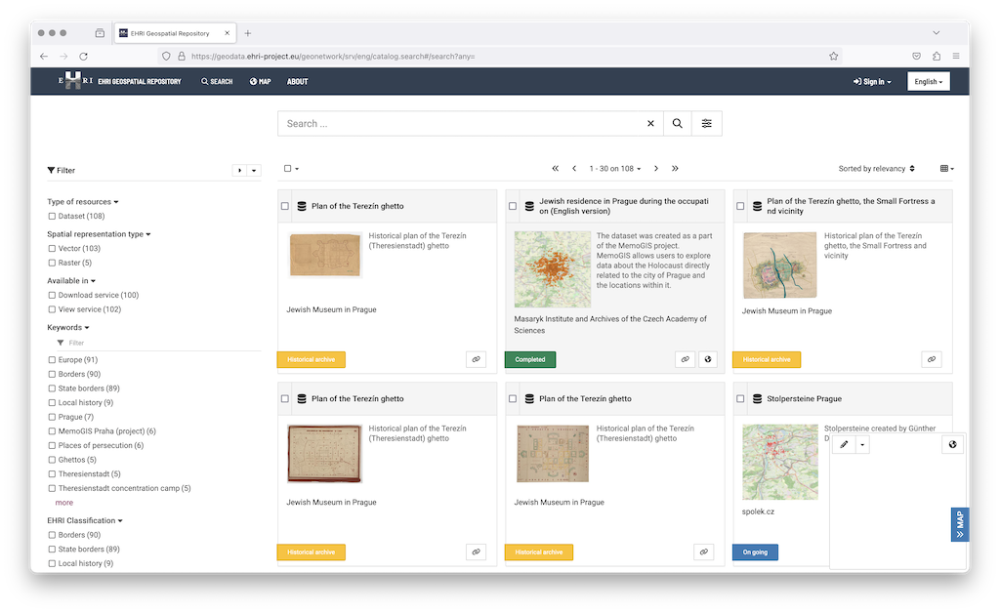


Have you ever needed to build a map of ghettos or camps for your research project? Analyse 
distances between them or trajectories walked by prisoners? Share your datasets with others 
in a reusable way?

The new [EHRI Geospatial Repository](https://geodata.ehri-project.eu/) aims to help researchers with these and similar challenges.


By providing access to data about Holocaust-related places and spaces, the EHRI Geospatial Repository 
facilitates research driven by spatial and geographic approaches. It builds on the spatial turn in the
field of Holocaust Studies: Over the past years, the research in Holocaust geographies, as conducted by
the [Holocaust Geographies Collaborative](http://holocaustgeographies.org/) and others, advanced new 
perspectives and methods. Thinking through place and space helps to formulate new questions and research projects.

The Geospatial Repository was developed within the EHRI-3 project in response to user needs: Our survey and 
focus groups indicated a strong demand for better access to standardised geospatial information. It showed 
that researchers, projects and institutions struggle to access the historical data that makes it possible 
to build maps, enrich datasets with place information, and more.

The EHRI Geospatial Repository provides researchers, projects and organisations with the means to:

- store and share geodata in a standard compliant, reusable way
- search and explore datasets based on their metadata
- use, download and combine datasets for mapping, data enrichment or spatial analysis

Currently filled with the first set of sample datasets, the Repository aims to provide access to a 
growing scope of geospatial data relating to the Holocaust. If you are interested in using it or 
contributing, please head to https://geodata.ehri-project.eu/.

If you have any questions, please read the [documentation](http://documentation.ehri-project.eu/en/latest/geospatial/) 
or contact us via email at geodata@ehri-project.eu.

---

_Below: screenshot of the repository. Cover image: [concentration camps dataset](https://geodata.ehri-project.eu/geonetwork/srv/eng/catalog.search#/metadata/52302460-13fd-4914-b496-2f0230e996e1)._

